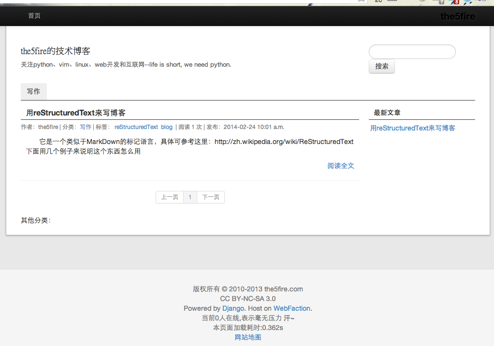
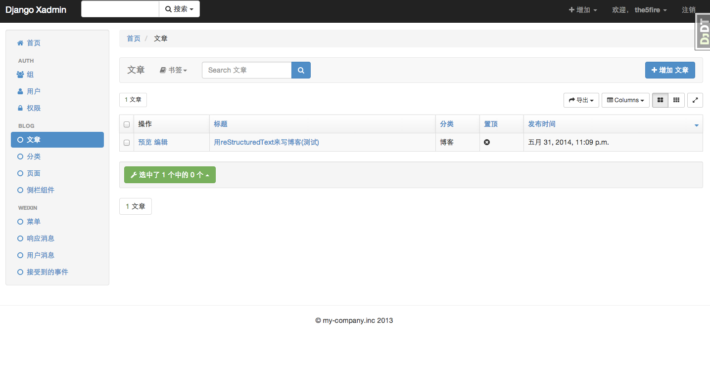

=======================
the5fire的技术博客源码
=======================

博客地址: http://the5fire.com

微信号:

.. image:: http://the5fireblog.b0.upaiyun.com/staticfile/getqrcode.jpeg

概述
-------------------------------
本博客系统基于Django1.5.1开发而成，通过gunicorn运行于Webfaction上，Python版本为2.7.4, 更多描述看这里：
`说说我这个博客的架构 <http://www.the5fire.com/blog-architecture.html>`_ ,其中Django的版本后来被升级为1.6.1的。

功能
-----------------------------
1. 文章、分类和页面的增删改查
2. 通过rst格式或者html格式书写文章正文
3. 侧边栏的组件化调整（目前比较弱）
4. 集成多说的评论
5. RSS和rpc
6. 其他的自己看把，博客上能看到的功能代码都在这里了

2014-05-02添加
--------------------------------
微信自动回复接口

2014-05-31
-------------------------------
后台修改为xadmin（0.5v）

哪些技术
------------------------------
主要是对Django的Class-Base View的一个实践。另外也是项目开发、部署、维护的基本流程的演练。
技术都在架构里有说。

如何使用
-----------------------------
安装virtualenv::

    sudo pip install virtualenv

创建虚拟环境::

    virtualenv www

把项目放到www目录，cd到目录中，执行::

    cd www
    # 激活虚拟环境
    source bin/activate
    # 安装依赖包
    pip install -r requirements.txt

创建数据库或表::

    # 针对sqlite3,mysql的话需要先创建数据库然后修改settings中的配置
    # 在django_selfblog/selfblog目录下执行
    python manage.py syncdb

运行::

    # 直接运行
    python manage.py runserver

    #或者用gunicorn
    gunicorn selfblog.wsgi:application

访问::

    http://localhost:8000

部署注意::

    需要修改settings中关于debug模式的判断
    需要修改数据库的设置
    需要修改DOMAIN和admin邮箱的设置
    ...

帮忙改善
-----------------------
本来打算在完善一些代码，再发出来，怎奈有太多的东西要学习，不能立马开始完善。遂想不如拿出来让大家一起改进。

分享你的blog
----------------------
我建了个ISSUE，方便用此源码的同学分享自己搭建的成果：https://github.com/the5fire/django_selfblog/issues/2

使用ansible一键部署
---------------------------
写了一个ansible的脚本: `deploy-blog-simple.yml <deploy-blog-simple.yml>`_

在配置好ansible之后，可以一句话完成部署操作::

    $ ansible-play deploy-blog-simple.yml

这样执行完成之后，程序会在你配置好的服务器上自动的搭建虚拟环境，并安装依赖，启动blog程序，监听在8000端口，直接可以通过ip+端口进行访问: http://your-ip:8000 ，后台地址:http://your-ip:8000/admin 用户名密码均为admin。

不了解ansible的童鞋可以看下这里: `ansible中文指南 <http://www.the5fire.com/ansible-guide-cn.html>`_

来个截图看看:

更新后xadmin的后台图:

